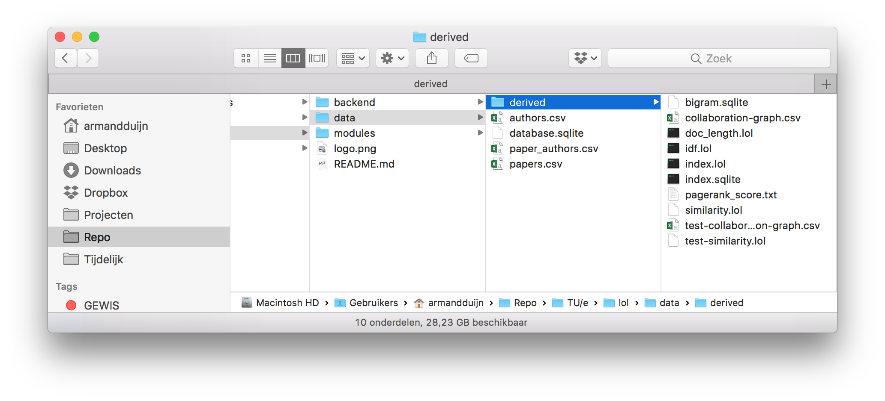

# Large Online Library (LOL)

## Why is the project called LOL?

The acronym stands for Large Online Library (Lol or \o/).

## Requirements

The system must have the following installed:

- Python v2.7 (or higher)
- PHP v7.1 (or higher)

## Installation

### Application

Inside the `backend` directory, run the command `php composer.phar install` to install the required Composer packages.

### Information Retrieval System

Inside the `modules` directory, run the command `pip install -r requirements.txt` to install the required Python packages.

Then, install the required NLTK data `python -m nltk.downloader all`.

### Dataset

The information retrieval system relies of pre-computed values to display relevant results. These pre-computed data files can be downloaded from an [online repository]() (1 GB) and must be placed inside the `data` directory.

The contents of the `data` directory should eventually look similar to the screenshot below.

## Usage

### Information Retrieval System

Inside the `modules` directory, run the command `python server.py`. This operation may take a while due to size of the pre-computed data files. 

After the command has imported the required data files, it will launch a [Flask](http://flask.pocoo.org) server on port 5000.

### Application

Inside the `backend` directory, run the command `php -S 0.0.0.0:8080 -t public public/index.php`. This will launch a PHP server on port 8080.

Now visit `http://localhost:8080` in your preferred browser to interact with the application.

